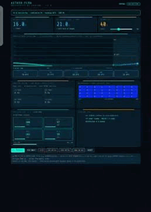

# Aether-Flow

**AI-Driven Predictive Thermal Management System**

> Aether-Flow predicts thermal events **15–30 seconds before they occur**
> by reading INA226 power draw sensors and running a Temporal Fusion
> Transformer model entirely on-device on a Raspberry Pi 5 — then
> pre-emptively activates Peltier cooling modules before temperature rises.
> No internet. No cloud. Fully offline.

---

## The Core Idea

Every cooling system today reacts **after** temperature rises. Aether-Flow acts **before**
— by reading the power draw signal that precedes heat by 5–15 seconds and predicting the outcome.
```
Normal:      [heat rises] → [sensor detects] → [cooling starts]  ← too late
Aether-Flow: [power rises] → [AI predicts] → [cooling starts]    ← before heat arrives
```

---

## Live Simulations



*Watch the blue dashed line rise BEFORE actual temperature moves —
that is the AI predicting the future and cooling starting early.*


Open directly in browser — no server needed:

- [Full AI Dashboard](https://singhhrishabh.github.io/Aether-flow/simulation/AetherFlow_WorkingModel.html)
- [How It Works Animation](https://singhhrishabh.github.io/Aether-flow/simulation/AetherFlow_HowItWorks.html)
- [3D Assembly Animation](https://singhhrishabh.github.io/Aether-flow/simulation/AetherFlow_Assembly.html)
- [6-Layer Architecture](https://singhhrishabh.github.io/Aether-flow/simulation/AetherFlow_LayerAnimation.html)
- [3-D view with Componenets](https://singhhrishabh.github.io/Aether-flow/simulation/Aetherflow_componentcatalogue.html)

---

Open any of these files directly in your browser — no server needed:

| File | What it shows |
|---|---|
| `simulation/AetherFlow_WorkingModel.html` | Full live AI dashboard with thermal camera, prediction timeline, Peltier control |
| `simulation/AetherFlow_HowItWorks.html` | Animated explainer of the full system |
| `simulation/AetherFlow_Assembly.html` | 3D assembly animation |
| `simulation/AetherFlow_LayerAnimation.html` | 6-layer architecture walkthrough |
| `simulation/Aetherflow_componentcatalogue.html` | 3D view with components |

---

## How It Works

**Step 1 — INA226 detects rising power draw**

Four INA226 power monitors read CPU, GPU, memory, and system rail current every 500ms. When a workload starts, current rises 5–15 seconds before temperature does.

**Step 2 — TFT model predicts future temperature**

A Temporal Fusion Transformer model running on Raspberry Pi 5 reads 60 seconds of sensor history and outputs temperature predictions at +5s, +10s, +15s, +20s, and +30s horizons. Inference takes under 30ms.

**Step 3 — Peltier modules cool before heat arrives**

ESP32 receives the predicted temperature and ramps up PWM to four TEC1-12706 Peltier modules immediately — while the actual temperature line is still flat.

---


## Architecture

```
┌─────────────────────────────────────────────────────┐
│                  PERCEPTION LAYER                   │
│  TMP117 ×6 · MLX90640 thermal cam · INA226 ×4       │
│  SHT40 humidity · YF-S201 flow sensor               │
│                   I2C bus — 500ms                   │
└──────────────────────┬──────────────────────────────┘
                       │
┌──────────────────────▼──────────────────────────────┐
│               INTELLIGENCE LAYER                    │
│         Raspberry Pi 5 — fully offline              │
│   TFT model (TFLite) → temperature prediction       │
│   PPO RL agent → optimal PWM per zone               │
│         USB serial → ESP32 commands                 │
└──────────────────────┬──────────────────────────────┘
                       │
┌──────────────────────▼──────────────────────────────┐
│                 ACTUATION LAYER                     │
│   ESP32 → IRF540N MOSFET × 4 → TEC1-12706 × 4       │
│   Kamoer NKP pump · Noctua fans · Safety relay      │
│         Hardware PID fallback if AI offline         │
└─────────────────────────────────────────────────────┘
```
---

## Target Performance

| Metric | Target | Validated |
|---|---|---|
| Temperature stability | ±0.3°C | Simulation only — hardware pending |
| AI inference latency | <30ms | Simulation only |
| Predictive horizon | 15–30 seconds | Simulation only |
| Energy savings | 35–41% vs PID | Design target — unvalidated |
| Acoustic noise | ~28 dB | Design target — unvalidated |
| Safety response | <50ms | Design target — unvalidated |

> **Honest note:** All performance figures are design targets or simulation
> results. Physical hardware validation is the next step and is the primary
> research objective.

---

## Current Status

- [x] All 4 subsystem circuits simulated and verified in Tinkercad
- [x] ESP32 firmware written — ready for hardware deployment
- [x] Raspberry Pi 5 data logger written (Python 3.11)
- [x] TFLite model training pipeline complete (PyTorch + PyTorch Forecasting)
- [x] Interactive AI simulation with predictive vs reactive comparison
- [x] Full project proposal with BOM, architecture, market analysis
- [ ] Physical hardware prototype — seeking lab access and funding
- [ ] Real sensor data collection (target: 100,000+ rows)
- [ ] TFT model training on real hardware data
- [ ] Performance validation against design targets

---

## Repository Structure

```
aether-flow/
├── firmware/
│   └── AetherFlow_Firmware.ino        ESP32 firmware (Arduino/FreeRTOS)
├── software/
│   ├── AetherFlow_DataLogger.py       Raspberry Pi sensor logger
│   ├── AetherFlow_Train.py            TFLite model training pipeline
│   └── requirements.txt
├── circuits/
│   ├── circuit1_temperature_sensing.png
│   ├── circuit2_mosfet_pwm.png
│   ├── circuit3_pid_controller.png
│   ├── circuit4_safety_relay.png
│   └── AetherFlow_Circuits.html       Interactive circuit viewer
├── simulation/
    ├── AetherFlow_WorkingModel.html   Live AI cooling simulation
    ├── AetherFlow_HowItWorks.html
    ├── AetherFlow_Assembly.html
    └── AetherFlow_LayerAnimation.html
    └── 3D view with components
```

---

## Hardware

| Component | Qty | Role |
|---|---|---|
| Raspberry Pi 5 4GB | 1 | AI inference |
| ESP32-WROOM-32 | 1 | PWM control |
| TEC1-12706 Peltier | 4 | Cooling |
| TMP117 sensor | 6 | Temperature |
| MLX90640 camera | 1 | IR heatmap |
| INA226 power monitor | 4 | AI input signal |

**Total BOM: ~$359 USD**

---

## Competitive Position

| | Fan+heatsink | Google DeepMind AI | Commercial BMS | **Aether-Flow** |
|---|---|---|---|---|
| Predictive | No | Yes (facility level) | No | **Yes (device level)** |
| Fully offline | Yes | No | Yes | **Yes** |
| Self-learning | No | Yes | No | **Yes** |
| <30ms inference | N/A | No | N/A | **Yes** |
| Thermal camera | No | No | No | **Yes** |
| Device-level | Yes | No | Partial | **Yes** |

---

## Markets Addressed

- **EV battery thermal management** — $58.9B by 2035 (16.3% CAGR)
- **Data centre liquid cooling** — $38.4B by 2033 (28.7% CAGR)
- **AI-driven BMS** — $18.5B by 2032 (20.6% CAGR)
- **Edge AI / Industrial IoT** — $18B by 2028
- **5G base stations** — $15B addressable

c

## Author

**Rishabh Singh**
B.E. ECE Year 1 — BITS Pilani Dubai Campus
[rishabh.s0072@gmail.com] | [https://www.linkedin.com/in/rishabh-singh-8b66003b2/?skipRedirect=true]

*Seeking research supervision and lab accesto build and validate
the physical prototype.

[GitHub](https://github.com/singhhrishabh) | [Live Demo](https://singhhrishabh.github.io/Aether-flow/)
